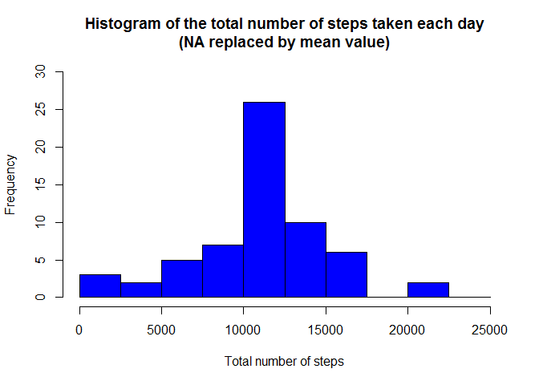

# Reproducible Research: Peer Assessment 1

## Loading and preprocessing the data


```r
if (!file.exists('activity.csv')) {
  unzip('activity.zip')
}
data.activity <- read.csv('activity.csv')
str(data.activity)
```

```
## 'data.frame':	17568 obs. of  3 variables:
##  $ steps   : int  NA NA NA NA NA NA NA NA NA NA ...
##  $ date    : Factor w/ 61 levels "2012-10-01","2012-10-02",..: 1 1 1 1 1 1 1 1 1 1 ...
##  $ interval: int  0 5 10 15 20 25 30 35 40 45 ...
```

```r
head(data.activity)
```

```
##   steps       date interval
## 1    NA 2012-10-01        0
## 2    NA 2012-10-01        5
## 3    NA 2012-10-01       10
## 4    NA 2012-10-01       15
## 5    NA 2012-10-01       20
## 6    NA 2012-10-01       25
```

-----

## What is mean total number of steps taken per day?


```r
totalStepsPerDay = tapply(data.activity$steps, data.activity$date, sum, na.rm = TRUE)
head(totalStepsPerDay)
```

```
## 2012-10-01 2012-10-02 2012-10-03 2012-10-04 2012-10-05 2012-10-06 
##          0        126      11352      12116      13294      15420
```

```r
hist(x = totalStepsPerDay, breaks = 20)
```

 

```r
mean <- mean(totalStepsPerDay)
median <- median(totalStepsPerDay)
```

* Mean is : 9354.2295082
* Median: 10395

-----

## What is the average daily activity pattern?

```r
library(ggplot2)
```

```
## Warning: package 'ggplot2' was built under R version 3.2.3
```

```r
averageIntervalSteps <- aggregate(x = list(meanSteps = data.activity$steps), 
                                  by=list(interval=data.activity$interval),
                                  FUN = mean,
                                  na.rm = TRUE)
                                  
dim(averageIntervalSteps)
```

```
## [1] 288   2
```

##### 1. Time series plot with the average Interval steps.


```r
ggplot(data=averageIntervalSteps, aes(x=interval, y=meanSteps)) +
    geom_line() +
    xlab("5-minute interval (hmm/hhmm)") +
    ylab("average number of steps taken") 
```

 

##### 2. Which 5-minute interval contains the max number of steps.


```r
maxIntervalSteps <- which.max(averageIntervalSteps$meanSteps)
timeMostSteps <-  gsub("([0-9]{1,2})([0-9]{2})", "\\1:\\2", averageIntervalSteps[maxIntervalSteps,'interval'])
```

** Most steps are at the time interval : 8:35

-----

## Imputing missing values

##### 1. Calculate and report the total number of missing values in the dataset 

```r
numberOfMissingVals <- nrow(data.activity[is.na(data.activity$steps),])
```

* Number of missing values : 2304


##### 2. Devise a strategy for filling in all of the missing values in the dataset. The strategy does not need to be sophisticated. For example, you could use the mean/median for that day, or the mean for that 5-minute interval, etc.

##### 3. Create a new dataset that is equal to the original dataset but with the missing data filled in.


```r
#find the NA positions
na_pos <- which(is.na(data.activity$steps))

#create a vector of means
mean_vec <- rep(mean(data.activity$steps, na.rm = TRUE), times = length(na_pos))

#new data set
new.data.activity <- data.activity

# Replace the NAs by the means
new.data.activity[na_pos, "steps"] <- mean_vec
```

##### 4. Make a histogram of the total number of steps taken each day 

```r
# Compute the total number of steps each day (NA values removed)
sum_data <- aggregate(new.data.activity$steps, by=list(new.data.activity$date), FUN=sum)

# Rename the attributes
names(sum_data) <- c("date", "total")

# Compute the histogram of the total number of steps each day
hist(sum_data$total, 
     breaks=seq(from=0, to=25000, by=2500),
     col="blue", 
     xlab="Total number of steps", 
     ylim=c(0, 30), 
     main="Histogram of the total number of steps taken each day\n(NA replaced by mean value)")
```

 

##### Calculate and report the mean and median total number of steps taken per day. 

```r
mean <- mean(sum_data$total)
med <- median(sum_data$total)
```

* Mean (Imputed): 1.0766189\times 10^{4}
* Median (Imputed):  1.0766189\times 10^{4}

## Are there differences in activity patterns between weekdays and weekends?

##### 1. Create a new factor variable in the dataset with two levels - "weekday" and "weekend" indicating whether a given date is a weekday or weekend day.


```r
new.data.activity$dateType <-  ifelse(as.POSIXlt(new.data.activity$date)$wday %in% c(0,6), 'weekend', 'weekday')
```

##### 2. Make a panel plot containing a time series plot


```r
library(ggplot2)

averagedActivityDataImputed <- aggregate(new.data.activity$steps, by=list(new.data.activity$interval, new.data.activity$dateType), FUN=mean)

names(averagedActivityDataImputed) = c('interval','dateType','steps')
ggplot(averagedActivityDataImputed, aes(interval, steps)) + 
    geom_line() + 
    facet_grid(dateType ~ .) +
    xlab("5-minute interval") + 
    ylab("avarage number of steps")
```

 

